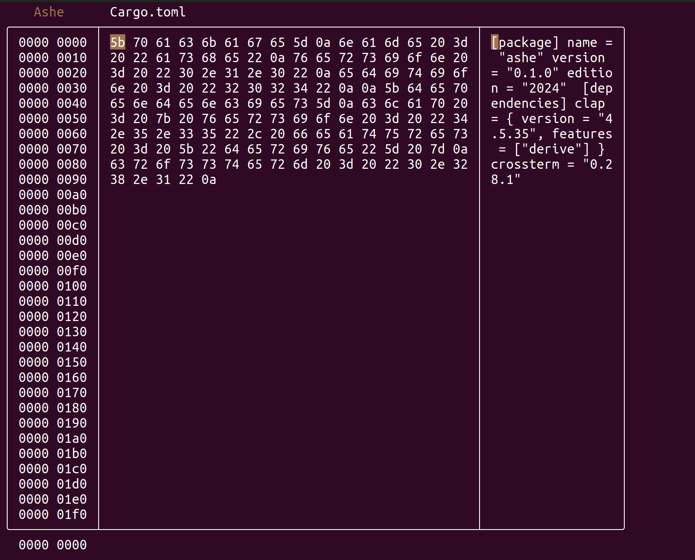

# Ashe – A Simple Hex Editor

Ashe is a lightweight console-based hex editor that lets you inspect and modify files, right from
your terminal. It has primarily been written to get more familiar with Rust.

## Features

- Hexadecimal view and direct editing
- Command mode for quick file operations

## Usage

### Edit Mode (Default)

- Navigate using arrow keys
- Edit bytes by typing hexadecimal values (0–9, A–F)

### Command Mode

Press `:` to enter Command Mode. The following commands are available:

- `w`, `write`: write the changes to the file
- `q`, `quit`: quit the program

Press Escape to return to Edit Mode.

### Force quit

The program can be forcefully ended by pressing `Ctrl` + `C`.

